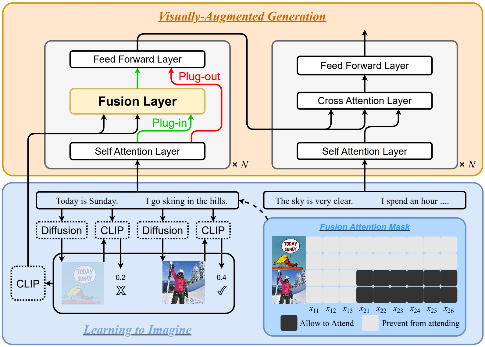

# LIVE
The official repository our ACL 2023 paper: "[Learning to Imagine: Visually-Augmented Natural Language Generation](https://arxiv.org/pdf/2305.16944.pdf)".



## Installation
```shell
cd transformers; pip install .
```

## Usage
```python
import torch
import torch.nn as nn
from transformers import BartForConditionalGeneration, T5ForConditionalGeneration, AutoModel

class LiveModel(nn.Module):
    def __init__(self):
        super().__init__()

        # self.model = BartForConditionalGeneration.from_pretrained('RUCAIBox/live-bart-base', image_fusion_encoder=True)
        # choose one
        # self.model = T5ForConditionalGeneration.from_pretrained('RUCAIBox/live-T5-base', image_fusion_encoder=True)
        self.vision_model = AutoModel.from_pretrained('openai/clip-vit-base-patch32').vision_model
        hidden_size = self.model.config.hidden_size
        self.trans = nn.Sequential(
            nn.Linear(self.vision_model.config.hidden_size, hidden_size * 4),
            nn.ReLU(),
            nn.Linear(hidden_size * 4, hidden_size),
        )

model = LiveModel()
# trans = torch.load('trans.bart.pth')
# choose one
# trans = torch.load('trans.t5.pth')
# trans.xx.pth can be downloaded at RUCAIBox/live-xx-base
model.trans.load_state_dict(trans)

# kwargs to model.forward() and model.generate()
# input_ids [batch_size, seq_len], same to hugging face
# attention_masks [batch_size, seq_len], same to hugging face
# labels [batch_size, seq_len], same to hugging face
# image_embeds [batch_size, image_num*patch_num, image_hidden_size], should be transfered using `trans`, image_num can be the sentence num of text, patch_num and image_hidden_size are 50 and 768 for openai/clip-vit-base-patch32, respectively
# images_mask [batch_size, seq_len, image_num], this is the mask in Figure 1, 1 represents the i-th word should attend to the j-th image
# images_mask_2d [batch_size, seq_len], 1 represents the i-th word should not be visually augmented, i.e., should not be attend to any image
```